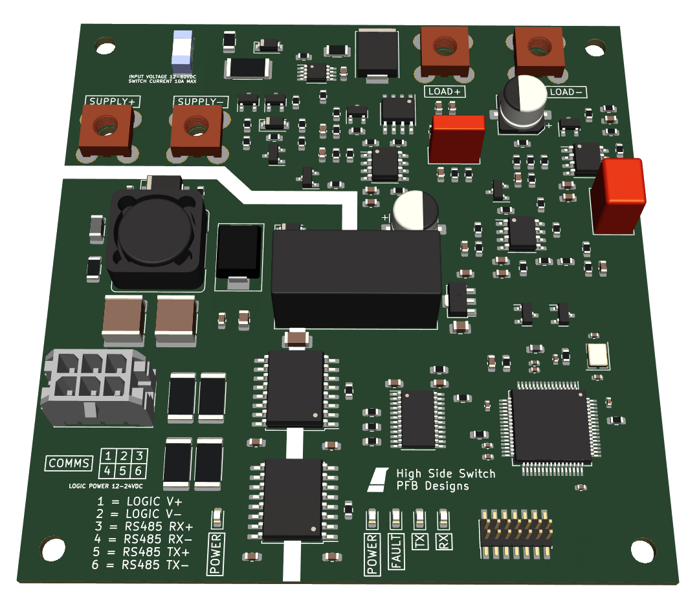
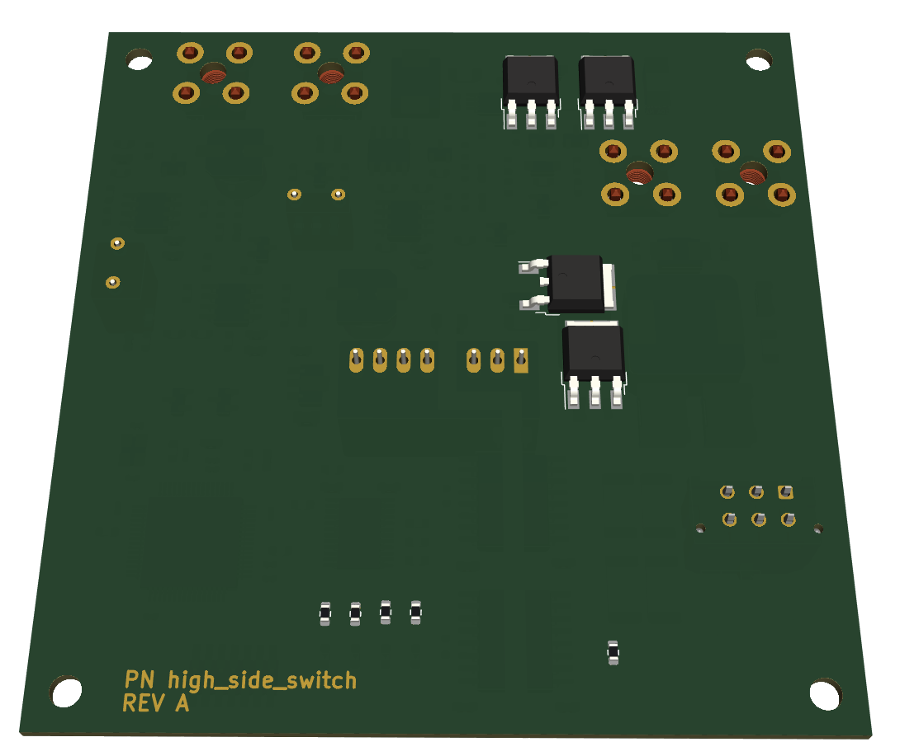
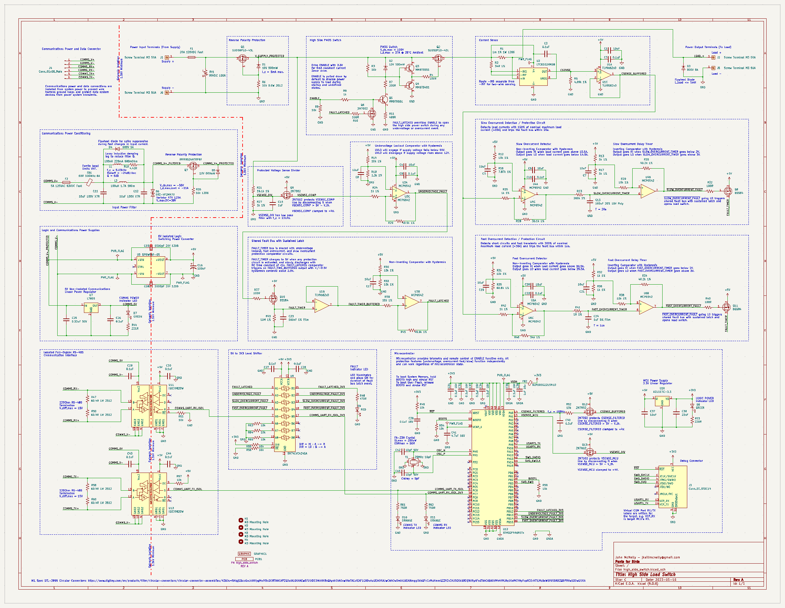

# high-side-switch
High side load switch for automotive and aerospace applications.

[Design Notes](word/design_notes_high_side_switch.pdf)

[Design Presentation](affinity/Onsite_Presentation_Reliable_Robotics.pdf)